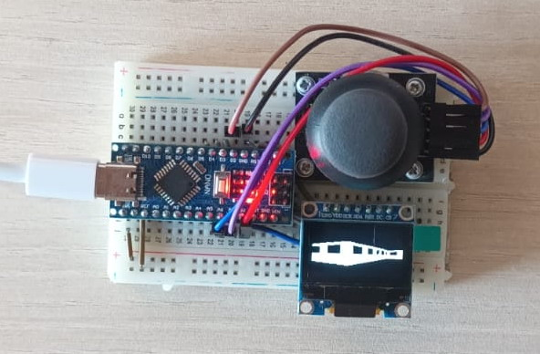

# Maze3D_on_Arduino
3D maze rendered with ray casting (like Wolfenstein 3D) on Arduino Nano microcontroller

Prepared to be opened with:
- Arduino IDE
- MS Visual Studio

Some design aims:
- use custom texture on walls, as opposed to many other similar implementations
- try to avoid using floating point computations
- optimize as much as possible
	- 20-30 FPS (depending on how tall the walls are being rendered)

Video demo available at: https://youtube.com/shorts/Yc5M3jKEmpE
